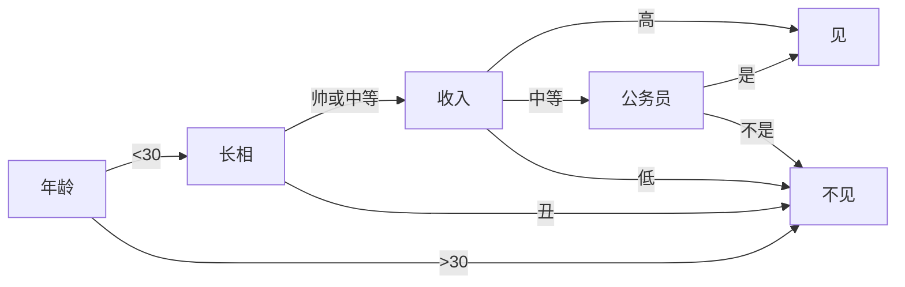
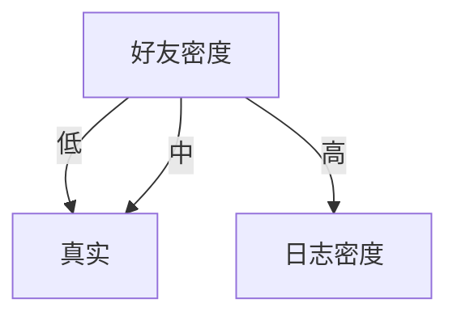

# 决策树

---

## 引导

上图基本可以算是一颗决策树。说它“基本可以算”是因为途中的判断条件没有量化，不能算是严格意义上的决策树。如果真的吧所有条件都量化，则就变成真正的决策树了。

决策树是一个树结构（不仅限于二叉树），其每个非叶节点表示一个特征属性上的厕所，每个分支代表这个特征属性在某个值域上的输出，而每个叶节点存放一个类别。使用决策树进行决策的过程就是从根节点开始，测试待分类项目中的特征属性，并按照其只选择输出分支，直到达到叶子节点，将叶子节点存放的类别作为决策结果。

## 决策树的构造

构造决策树的关键步骤是分裂属性。所谓分裂属性，就是在某个节点处，按照一个特征属性的不同划分构造不同的分支，其目标是让各个分裂自己尽可能地“纯”。尽可能“纯”就是尽量让一个分裂子集中待分类项属于同一类别。分裂属性氛围三种不同的情况：

1. 离散属性，不要求二叉树：用属性的每个划分作为一个分支

2. 离散属性，要求二叉树：使用属性划分的一个子集进行测试，按照“属于此子集” 和“不属于此子集“分成两个分支

3. 连续属性：确定一个分裂点`split_point`，根据分裂点对属性进行分类
$$
y = 
\begin{cases}
  1, x > split_point \\
  0, x \leq  split_point
\end{cases}
$$

怎样针对连续属性确定合适的`split_point`是构造决策树的关键。一般使用**自顶向下递归分治法**，并采用不回溯的**贪心策略**。

### ID3算法

从信息论知识中我们知道，期望信息越小，信息增益越大，从而纯度越高。所以ID3算法的核心思想就是以信息增益度属性选择，选择分裂后信息增益最大的属性进行分裂。

首先定义几个概念：

- 熵

  设D为样本集的分类情况，则D的熵为：
$$
info(D) = - \sum_{i = 1}^m p_i \log_2{(p_i)}
$$

  	其中$p_i$表示第i个分类在整个样本集中出现的概率，即$\frac{属于此类别的样本数}{样本总数}$。熵的意义即为**D中元组的类别标号所需要的平均信息量**。

- 属性对划分的期望信息
  现在我们假设将训练元组D按属性A进行划分，则A对D划分的期望信息为：
$$
  info_A(D) = \sum_{j = 1}^{v} \frac{|D_j|}{|D|} info(D_j)
$$

  	其中$D_j$表示对D按属性A进行分类时，**属于第j个叶子节点的样本集**。

​	属性对划分的期望信息表达了该属性的的信息量。

- 信息增益
  属性A的信息增益为属性对划分的期望信息与熵的差值：
$$
\begin{aligned}
gain(A) & = info(D) - info_A(D) \\
		& = - \sum_{i = 1}^m p_i \log_2{(p_i)} - \sum_{j = 1}^{v} \frac{|D_j|}{|D|} info(D_j)
\end{aligned}
$$

ID3算法就是在每次需要分裂时，计算每个属性的增益率，然后选择增疑虑最大的属性进行分裂。下面我们继续用SNS社区不真实账号检测的例子说明使用ID3算法构造决策树。为了简单起见，我们假设训练集合包含10个元素：

| 日志密度 | 好友密度 | 是否使用真实头像 | 账号是否真实 |
| ---- | ---- | -------- | ------ |
| ↑    | ↑    | ×        | ×      |
| ↑    | ↓    | √        | √      |
| ↓    | -    | √        | √      |
| -    | -    | √        | √      |
| ↓    | -    | √        | √      |
| -    | ↓    | ×        | √      |
| -    | ↑    | ×        | ×      |
| ↓    | -    | ×        | √      |
| -    | ↑    | ×        | √      |
| ↑    | ↑    | √        | ×      |

设L、F、H和R表示日志密度、好友密度、是否使用真实头像和账号是否真实，计算各属性的信息增益。

以日志密度为例：
$$
\begin{aligned}
    info(D)   & = - 0.7 * \log_2 0.7 - 0.3 \log_2 0.3 = 0.879 \\
    info_L(D) & = 0.3 * (- \frac03 \log_2 \frac03 - \frac33 \log_2 \frac 33) + \\
    & 0.4 * (- \frac14 \log_2 \frac14 - \frac34 \log_2 \frac 34) + \\
    & 0.3 * (- \frac13 \log_2 \frac13 - \frac23 \log_2 \frac 23) \\
    		  & = 0 + 0.326 + 0.277 \\
    		  & = 0.603 \\
    gain(L)    & = 0.879 - 0.603 = 0.276
  \end{aligned}
$$
用同样方法得到H和F的信息增益分别为0.033和0.553。

因此F具有最大的信息增益，所以第一次分裂选择F为分裂属性

以此为基础，再递归使用这个方法中计算子节点的分裂属性，就最终得到整个决策树

上面为了简便，将特征属性离散化了，其实日志密度和好友密度都是连续的属性。对于特征属性为连续值，可以如此如此使用ID3算法：

先将D中元素按照特征属性排序，则每两个相邻元素的中间点可以看做潜在分裂点，从第一个潜在分裂点开始，分裂D并且计算两个集合的期望信息，具有最小期望信息的点称为这个属性的最佳分裂点，其信息期望作为此属性的信息期望。

### C4.5算法

ID3算法存在一个问题，就是偏向于多值属性，例如，如果存在唯一标识属性ID，则ID3会选择它作为分裂属性，这样虽然使得划分充分纯净，但这种划分对分类几乎毫无用处。ID3的后继算法C4.5使用**增益率**的信息增益扩充，试图克服这个偏倚。

C4.5算法首先定义了`分裂信息`，其定义可以表示成：
$$
split\_info_A(D) = - \sum _{j = 1}^v \frac {|D_j|} D \log _2 {\frac {|D_j|} {|D|}}
$$
其增益率被定义为：
$$
gain\_ratio(A) = \frac {grain(A)} {split\_info(A)}
$$
C4.5选择具有最大增益率的属性作为分裂属性，其具体应用于ID3类似

## 补充

### 属性用完了怎么办

在决策树构造过程中可能会出现这种情况：所有属性都作为分裂属性用光了，但有的子集还不是纯净集，即集合内的元素不属于同一类别。在这种情况下，由于没有更多信息可以使用了，一般对这些子集进行**多数表决**，即使用此子集中出现次数最多的类别作为此节点类别，然后将此节点作为叶子节点。

### 关于剪枝

实际构造决策树时，通常要进行剪枝，这是为了处理由于数据中的噪声和离群点导致的过拟合问题。剪枝有两种：

1. 先剪枝：

   在构造过程中，当某个节点满足剪枝条件，则直接停止此分支的构造。

2. 后剪枝：

   县构造完整的决策树，再通过某些条件遍历数进行剪枝。

---

# 参考

[决策树](http://www.cnblogs.com/leoo2sk/archive/2010/09/19/decision-tree.html)