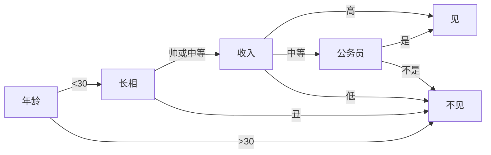
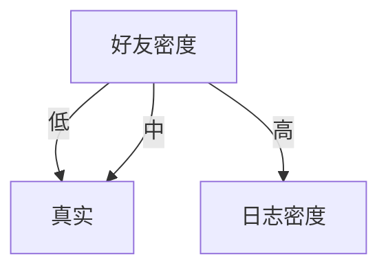

# 逻辑回归

## 回归
出自**高尔顿**种豆子的实验，通过大量数据统计，他发现**个体小的豆子**往往倾向于产生**比其更大的子代**，而**个体大的豆子**则倾向于产生**比其小的子代**，然后高尔顿认为这是由于新个体在向这种豆子的平均尺寸**“回归”**，大概的意思就是事物总是倾向于朝着某种**“平均”**发展，也可以说是回归于事物平均水平。

## 回归分析

与“回归”最早表达的意思稍有些微妙和不同，现在我们用“回归”来表示**对于均值（期望值）的预测**

回归分析多用于估计事物的可能性。比如某用户购买某商品的可能性，某人患有某种疾病的可能性等。

## 分类问题
### 定义

分类是**监督学习**的一个核心问题，在监督学习中，当输出变量`Y`取**有限个离散值**时，预测问题便成为**分类问题**。

输入变量`X`可以是离散的，也可以是连续的。监督学习从数据中学习一个分类模型或分类决策函数，称为**分类器**(classifier)。

分类器对新的输入进行输出的**预测**(prediction)，称为**分类**(classification)。

### 要素

- 类型：**监督学习**

- 输入`x`：可以为连续或离散
- 输出`y`：属于**有限个离散值**
- 目的：根据输入`x`**预测**`y`
- 手段：从**数据**中训练出一个**分类器**，其可以是一个**分类模型**或**分类决策函数**(决策树?)

## 从线性回归到逻辑回归

### 线性回归模型的局限性

线性回归的鲁棒性很差，对于噪点的处理能力很差。

这主要是由于线性回归在整个实数域内敏感度一致。对于二分类问题来说，回归模型的值域应该是在`[0, 1]`以内的。

### 逻辑回归
逻辑回归的目的是一种减小预测范围，将预测值限定为[0,1]间的一种回归模型。希望这种回归模型的图像呈现**S形**在回归边界附近十分敏感，而在远离回归模型的位置则不敏感。
$$
h_\theta(x) = g(\theta^T x) \in [0, 1]
$$

## 模型函数

### 表达式：Sigmoid函数

**Sigmoid**函数又称**Logistic**函数(逻辑函数)，图像呈**S形**，值域为**(0, 1)**

$$
g(z) = \frac{1}{1 + e^{-z}}
$$

### 图像

### 模型函数
$$
h_\theta(x) = g(\theta^T x) = \frac{1}{1 + e^{-\theta^T x}}
$$

$h_\theta(x)$有特殊的含义，它表示结果为1的概率：对于输入x分类结果为类别1和类别0的概率分别为：

$$
P(y = 1 | x; \theta) = h_\theta(x)
$$

$$
P(y = 0 | x; \theta) = 1 - h_\theta(x)
$$

### 例子

对于肿瘤（0 - 恶性 / 1 - 良性），如果输入的**特征变量**为**性别**和**肿瘤**的大小：

$$
x = \left[ \begin{matrix} x_0 \\ x_1 \end{matrix} \right] = \left[ \begin{matrix} 1 \\ 肿瘤尺寸 \end{matrix} \right]
$$

$$
\theta = \left[ \begin{matrix} 性别影响程度(迭代更新) \\ 尺寸影响程度(迭代更新)\end{matrix} \right]
$$

$$
P(y = 1 | x; \theta) = h_\theta(x) = 0.7
$$

即可得出：当性别为1，肿瘤尺寸为$x_1$时，患者为恶性肿瘤的概率为70%

## 决策边界

如上，逻辑回归模型可以表示为

$$
h_\theta(x) = g(\theta^T x) \\
g(z) = \frac{1}{1 + e^{-z}}
$$

假设给定的阀值为`0.5` ，`y = 0`，则

$$
\begin{aligned}
  \because & y =
    \begin{cases}
      1, h_\theta(x) \geq 0.5 \\
      0, h_\theta(x) < 0.5
    \end{cases} \\
  \therefore & h_\theta(x) = \frac{1}{1+e^{-\theta^Tx}} < 0.5 \\
  \therefore & {\bf \theta^Tx < 0}
\end{aligned}
$$

我们可以认为$\theta^Tx = 0$是一个决策边界，当它`大于0`或`小于0`时，逻辑回归模型分别预测不同的分类结果

### 线性边界

假定

$$
h_\theta(x) = g(\theta_0 + \theta_1 x_1 + \theta_2 x_2) \\
\theta = \left[ \begin{matrix}
\theta_0 \\
\theta_1 \\
\theta_2
\end{matrix} \right] = \left[ \begin{matrix}
-3 \\
1 \\
1
\end{matrix} \right]
$$

则$x_1 + x_2 = 3$既为一个决策边界

这样既可得到一个线性回归边界

### 非线性边界

假定

$$
h_\theta(x) = g(\theta_0 + \theta_1 x_1 + \theta_2 x_1^2 + \theta_3 x_2 + \theta_4 x_2^2)
$$

这里$x_1^2 + x_2^2 = 1$即为决策边界，图像为一个圆形

## 损失函数

监督学习问题是在**假设空间**`F`中选取**模型**`f`作为**决策函数**，对于给定的输入`X`，由`f(X)`给出相应的输出`Y`，这个输出的预测值`f(X)`与真实值`Y`可能一致也可能不一致，用一个**损失函数**(loss function)或**代价函数**(cost function)来度量**预测误差**。损失函数是`f(X)`和`Y`的**非负实值函数**，记作**L(Y, f(X))**.

统计学习中常用的损失函数有以下几种：

- **0-1**损失函数

$$
L(Y, f(x)) = 
\begin{cases}
1,\ Y \neq f(x) \\
0,\ Y = f(x)
\end{cases}
$$

- **平方**损失函数

$$
L(Y, f(x)) = (Y - f(x))^2
$$

- **绝对**损失函数

$$
L(Y, f(x)) = | Y - f(x) |
$$

- **对数**损失函数

$$
L(Y, P(Y|X)) = - \log P(Y|X)
$$

损失函数越小，模型就越好。

### 线性平方损失函数不适用

逻辑回归是一种有监督的学习方法，因此有训练集：

$$
\{(x^{(1)}, y^{(1)}), (x^{(2)}, y^{(2)}), (x^{(3)}, y^{(3)}), \cdots , (x^{(m)}, y^{(m)})\}
$$

对于`m`个训练样本，每个样本共有`n + 1`个特征

$$
x \in
\left[
  \begin{matrix}
  x_0 \\
  x_1 \\
  \vdots \\
  x_n \\
  \end{matrix}
\right]
$$

其中$x \in R^{n+1}, x_0 = 1, y \in \{1, 0\}$，我们的问题是如何取到合适的`θ`

线性回归的损失函数J(θ)为

$$
J(\theta) =  \frac{1}{m} \sum_{i = 0}^m \frac{1}{2}(h_\theta(x^{(i)}) - y^{(i)})^2
$$

这里可以把$\frac{1}{2}(h_\theta(x^{(i)}) - y^{(i)})^2$缩写为$Cost(h_\theta(x), y)$

如果和线性回归相似，这里取$h_\theta(x) = \frac{1}{1 + e^{-\theta^T x}}$，会存在一个问题，也就是逻辑回归的损失函数是**非凸**的

我们知道，线性回归的损失函数是**凸函数**，具有碗状的形状，而凸函数具有良好的性质：对于凸函数来说局部最小值点即为全局最小值点，因此只要能求得这类函数的一个最小值点，该点一定为全局最小值点。

因此，上述的损失函数对于逻辑回归是不可行的，我们需要其他形式的函数来保证逻辑回归的损失函数是凸函数。

### 对数0-1损失函数

这里可以选择对数似然函数作为逻辑回归的损失函数

$$
Cost(h_\theta(x), y) = 
\left\{
  \begin{matrix}
  -\log (h_\theta(x)), & y = 1 \\
  -\log (1 - h_\theta(x)), & y = 0
  \end{matrix}
\right.
$$

首先看当`y = 1`时：

预测结果$h_\theta(x) \rightarrow 1$，则损失度 $J(\theta) \rightarrow 0$

预测结果$h_\theta(x) \rightarrow 0$，则损失度 $J(\theta) \rightarrow \infty$

反之同理

## 简化版代价函数及梯度下降算法

逻辑回归的损失函数可以表示为

$$
\begin{cases}
J(\theta) = \frac{1}{m} \sum_{i=1}^m Cost(h_\theta(x), y) \\ \\
Cost(h_\theta(x), y) = 
\left\{
  \begin{matrix}
  -\log (h_\theta(x)), & y = 1 \\
  -\log (1 - h_\theta(x)), & y = 0
  \end{matrix}
\right. \\
\end{cases}
$$

由于y 只能等于0或1，所以可以将逻辑回归中的损失函数的两个公式合并

$$
\begin{aligned}
J(\theta)
& = \frac{1}{m} \sum_{i = 1}^{m} Cost(h_\theta(x), y) \\
& = -\frac{1}{m} \left[ \sum_{i = 1}^m y^{(i)} \log{h_\theta(x^{(i)})} + (1 - y^{(i)}) \log{(1 - h_\theta(x^{(i)}))} \right]
\end{aligned}
$$

对于这个公式，这里稍微补充一点，注意中括号中的公式正是对逻辑回归进行最大似然估计中的最大似然函数，对于最大似然函数求最大值，从而得到参数的估计值。

$$
\begin {aligned} 
  \frac{\delta}{\delta \theta_j} (l(\theta))
    & = \frac{\delta}{\delta \theta_j} (\sum_{i = 1}^m y^{(i)} \log{(h(x^{(i)})) + (1 - y^{(i)} \log(1 - h(x^{(i)}))}) \\
    & = \cdots \\
    & = (y^{(i)} - h_\theta (x^{(i)}))x_j
\end {aligned} \\
$$
因此 ...

# 决策树

---

## 引导

上图基本可以算是一颗决策树。说它“基本可以算”是因为途中的判断条件没有量化，不能算是严格意义上的决策树。如果真的吧所有条件都量化，则就变成真正的决策树了。

决策树是一个树结构（不仅限于二叉树），其每个非叶节点表示一个特征属性上的厕所，每个分支代表这个特征属性在某个值域上的输出，而每个叶节点存放一个类别。使用决策树进行决策的过程就是从根节点开始，测试待分类项目中的特征属性，并按照其只选择输出分支，直到达到叶子节点，将叶子节点存放的类别作为决策结果。

## 决策树的构造

构造决策树的关键步骤是分裂属性。所谓分裂属性，就是在某个节点处，按照一个特征属性的不同划分构造不同的分支，其目标是让各个分裂自己尽可能地“纯”。尽可能“纯”就是尽量让一个分裂子集中待分类项属于同一类别。分裂属性氛围三种不同的情况：

1. 离散属性，不要求二叉树：用属性的每个划分作为一个分支

2. 离散属性，要求二叉树：使用属性划分的一个子集进行测试，按照“属于此子集” 和“不属于此子集“分成两个分支

3. 连续属性：确定一个分裂点`split_point`，根据分裂点对属性进行分类
$$
y = 
\begin{cases}
  1, x > split_point \\
  0, x \leq  split_point
\end{cases}
$$

怎样针对连续属性确定合适的`split_point`是构造决策树的关键。一般使用**自顶向下递归分治法**，并采用不回溯的**贪心策略**。

### ID3算法

从信息论知识中我们知道，期望信息越小，信息增益越大，从而纯度越高。所以ID3算法的核心思想就是以信息增益度属性选择，选择分裂后信息增益最大的属性进行分裂。

首先定义几个概念：

- 熵

  设D为样本集的分类情况，则D的熵为：
$$
info(D) = - \sum_{i = 1}^m p_i \log_2{(p_i)}
$$

  	其中$p_i$表示第i个分类在整个样本集中出现的概率，即$\frac{属于此类别的样本数}{样本总数}$。熵的意义即为**D中元组的类别标号所需要的平均信息量**。

- 属性对划分的期望信息
  现在我们假设将训练元组D按属性A进行划分，则A对D划分的期望信息为：
$$
  info_A(D) = \sum_{j = 1}^{v} \frac{|D_j|}{|D|} info(D_j)
$$

  	其中$D_j$表示对D按属性A进行分类时，**属于第j个叶子节点的样本集**。

​	属性对划分的期望信息表达了该属性的的信息量。

- 信息增益
  属性A的信息增益为属性对划分的期望信息与熵的差值：
$$
\begin{aligned}
gain(A) & = info(D) - info_A(D) \\
		& = - \sum_{i = 1}^m p_i \log_2{(p_i)} - \sum_{j = 1}^{v} \frac{|D_j|}{|D|} info(D_j)
\end{aligned}
$$

ID3算法就是在每次需要分裂时，计算每个属性的增益率，然后选择增疑虑最大的属性进行分裂。下面我们继续用SNS社区不真实账号检测的例子说明使用ID3算法构造决策树。为了简单起见，我们假设训练集合包含10个元素：

| 日志密度 | 好友密度 | 是否使用真实头像 | 账号是否真实 |
| ---- | ---- | -------- | ------ |
| ↑    | ↑    | ×        | ×      |
| ↑    | ↓    | √        | √      |
| ↓    | -    | √        | √      |
| -    | -    | √        | √      |
| ↓    | -    | √        | √      |
| -    | ↓    | ×        | √      |
| -    | ↑    | ×        | ×      |
| ↓    | -    | ×        | √      |
| -    | ↑    | ×        | √      |
| ↑    | ↑    | √        | ×      |

设L、F、H和R表示日志密度、好友密度、是否使用真实头像和账号是否真实，计算各属性的信息增益。

以日志密度为例：
$$
\begin{aligned}
    info(D)   & = - 0.7 * \log_2 0.7 - 0.3 \log_2 0.3 = 0.879 \\
    info_L(D) & = 0.3 * (- \frac03 \log_2 \frac03 - \frac33 \log_2 \frac 33) + \\
    & 0.4 * (- \frac14 \log_2 \frac14 - \frac34 \log_2 \frac 34) + \\
    & 0.3 * (- \frac13 \log_2 \frac13 - \frac23 \log_2 \frac 23) \\
    		  & = 0 + 0.326 + 0.277 \\
    		  & = 0.603 \\
    gain(L)    & = 0.879 - 0.603 = 0.276
  \end{aligned}
$$
用同样方法得到H和F的信息增益分别为0.033和0.553。

因此F具有最大的信息增益，所以第一次分裂选择F为分裂属性

以此为基础，再递归使用这个方法中计算子节点的分裂属性，就最终得到整个决策树

上面为了简便，将特征属性离散化了，其实日志密度和好友密度都是连续的属性。对于特征属性为连续值，可以如此如此使用ID3算法：

先将D中元素按照特征属性排序，则每两个相邻元素的中间点可以看做潜在分裂点，从第一个潜在分裂点开始，分裂D并且计算两个集合的期望信息，具有最小期望信息的点称为这个属性的最佳分裂点，其信息期望作为此属性的信息期望。

### C4.5算法

ID3算法存在一个问题，就是偏向于多值属性，例如，如果存在唯一标识属性ID，则ID3会选择它作为分裂属性，这样虽然使得划分充分纯净，但这种划分对分类几乎毫无用处。ID3的后继算法C4.5使用**增益率**的信息增益扩充，试图克服这个偏倚。

C4.5算法首先定义了`分裂信息`，其定义可以表示成：
$$
split\_info_A(D) = - \sum _{j = 1}^v \frac {|D_j|} D \log _2 {\frac {|D_j|} {|D|}}
$$
其增益率被定义为：
$$
gain\_ratio(A) = \frac {grain(A)} {split\_info(A)}
$$
C4.5选择具有最大增益率的属性作为分裂属性，其具体应用于ID3类似

## 补充

### 属性用完了怎么办

在决策树构造过程中可能会出现这种情况：所有属性都作为分裂属性用光了，但有的子集还不是纯净集，即集合内的元素不属于同一类别。在这种情况下，由于没有更多信息可以使用了，一般对这些子集进行**多数表决**，即使用此子集中出现次数最多的类别作为此节点类别，然后将此节点作为叶子节点。

### 关于剪枝

实际构造决策树时，通常要进行剪枝，这是为了处理由于数据中的噪声和离群点导致的过拟合问题。剪枝有两种：

1. 先剪枝：

   在构造过程中，当某个节点满足剪枝条件，则直接停止此分支的构造。

2. 后剪枝：

   县构造完整的决策树，再通过某些条件遍历数进行剪枝。

---

# 参考

[笔记](http://52opencourse.com/125/coursera%E5%85%AC%E5%BC%80%E8%AF%BE%E7%AC%94%E8%AE%B0-%E6%96%AF%E5%9D%A6%E7%A6%8F%E5%A4%A7%E5%AD%A6%E6%9C%BA%E5%99%A8%E5%AD%A6%E4%B9%A0%E7%AC%AC%E5%85%AD%E8%AF%BE-%E9%80%BB%E8%BE%91%E5%9B%9E%E5%BD%92-logistic-regression)

[逻辑回归模型 - 推酷](http://www.tuicool.com/articles/auQFju)

[MarkDown输入数学公式](http://blog.csdn.net/smstong/article/details/44340637)

[决策树](http://www.cnblogs.com/leoo2sk/archive/2010/09/19/decision-tree.html)